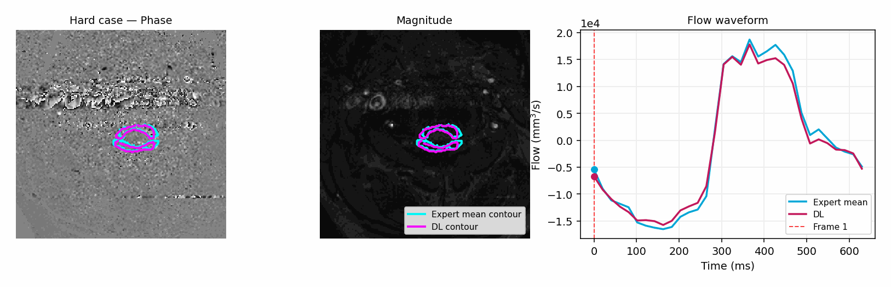

# Experts-vs-2D-UNet-C2-C3-segmentation



**Project Title:** Deep Learning vs. Manual Segmentation for Spinal CSF Flow in PC-MRI  
**Event:** Accepted for Oral Presentation at ISRMR 2026  

## Overview
This repository contains the code for DICOM-based cerebrospinal fluid (CSF) Phase-Contrast MRI (PC-MRI) flow visualization and Deep Learning segmentation using a 2D U-Net. 

The main entry point of this project is the interactive Jupyter Notebook (`dicom_csf_flow_viewer.ipynb`). This notebook allows users to read a specified DICOM directory, automatically select the relevant PC-MRI series, run a trained Deep Learning model to predict the CSF Region of Interest (ROI), compute flow biomarkers, and visualize the flow curve and segmentation overlays.

## Prerequisites & Environment Setup
We recommend using [Conda](https://docs.conda.io/en/latest/) to create an isolated environment for this project.

1. **Create a new conda environment** (Python 3.9 or 3.10 recommended):
   ```bash
   conda create -n csf_seg python=3.10
   ```
2. **Activate the environment**:
   ```bash
   conda activate csf_seg
   ```
3. **Install the required dependencies**:
   ```bash
   pip install -r requirements.txt
   ```
*(Note: Depending on your hardware, you may want to install a specific version of PyTorch with GPU support following the official [PyTorch installation guide](https://pytorch.org/).)*

## Repository Structure & Necessary Files
For the notebook to run successfully, ensure that the following file structure is preserved, keeping the notebook in the same directory as the Python modules:

```text
.
├── dicom_csf_flow_viewer.ipynb       # Main interactive notebook
├── config_bio.yaml                   # YAML configuration file
├── preprocess_dicom.py               # DICOM processing & inventory module
├── csf_flow.py                       # Biomarker & flow computation module
├── src/                              # Source code directory
│   ├── models/
│   │   └── unet2d.py                 # UNet2D model architecture
│   └── utils/
│       ├── misc.py                   # Checkpoint loading utility
│       └── temporal_features.py      # Feature extraction functions
└── outputs/                          # Directory for DL model checkpoints
```

## Using DICOM Files & Configuration
**Important:** Due to data privacy and size constraints, the raw DICOM files are **not** provided in this repository. 

To run the notebook with your own PC-MRI DICOM data, follow these steps:
1. **Organize Data:** Ensure your DICOM files are structured in a folder containing a standard `DICOMDIR` file.
2. **Configure Paths:** Open the `config_bio.yaml` file and update the `paths.dicomdir` value to point to your local DICOM directory.
   ```yaml
   paths:
     dicomdir: /path/to/your/DICOMDIR
   ```
3. **Series Selection:** The notebook automatically selects the PC-MRI series based on the metadata. If it fails to select the right series, you can manually specify the target series in `config_bio.yaml` under `series_selection.series_number`.
4. **Checkpoints:** Make sure that the path to your trained model checkpoint (e.g., `outputs/unet2d_full_c80_b32_flow_dice/checkpoints/best_model.pt`) is correctly specified under `model.checkpoint` in the YAML file. 
5. **Fallbacks:** Verify the metadata fallback values in the config (`pixel_size_mm`, `delay_trigger_ms`, `v_enc`) are suited for your machine if standard DICOM tags are missing.

## Usage
Once your environment is set up and your `config_bio.yaml` file is configured:
1. Launch the Jupyter Notebook interface:
   ```bash
   jupyter notebook
   ```
2. Open `dicom_csf_flow_viewer.ipynb`.
3. Run the cells sequentially. The notebook will print a full series inventory, load your DICOM images, predict the CSF mask using the pre-trained weights, calculate your flow biomarkers (e.g., stroke volume, flow amplitude), and finally plot the flow curves and image overlays.
